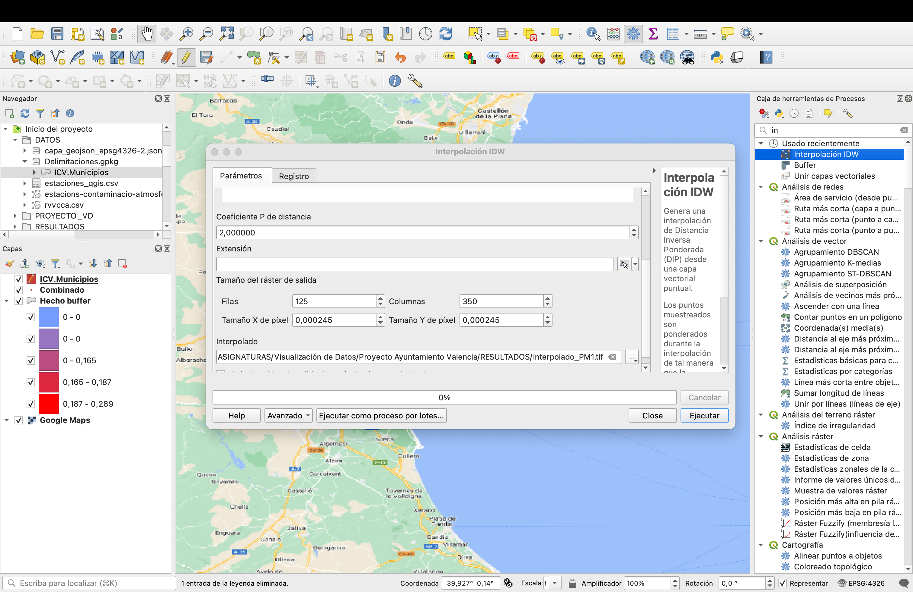
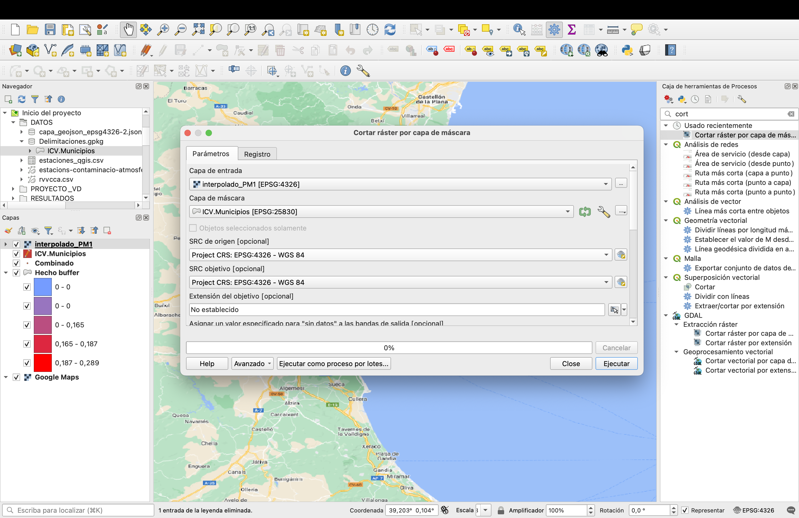

```{r setup, include=FALSE}
knitr::opts_chunk$set(echo = TRUE)
```

En este proyecto de visualización de datos vamos a analizar un conjunto de datos relacionados con la contaminación átmosferica que hay en diferentes puntos de la ciudad de valencia, procedemos a realizar un análisis univariante de los datos, pero antes de ello, realizaremos un acondicionamiento de los datos, eliminando variables que no aportan información y o que son irrelevantes para el estudio.

Para ello leemos los datos proporcionados por el ayuntamiento de valencia:

## 1. Lectura de los datos.

```{r}
library(readr)
library(dplyr)

df <- read_delim("rvvcca.csv", 
    delim = ";", escape_double = FALSE, trim_ws = TRUE)
```

## 2. Acondicionamiento de los datos.

Voy a elimanar la columna "Id" que no me aporta ninguna informacion, como tampoco lo hace la columna "Fecha baja" y "Fecha Creacion", además al realizar un pequeño analisis visual de los datos me doy cuenta de que las variables donde se ve el ng/m3 de cada sustancia no contiene informacion para la gran mayoría de registros y por tanto procedo a eliminarlas.

```{r}
df <- df %>% 
  select(!(c("Id", "Fecha baja","Fecha creacion"))) %>%
  select(1:26)
```

Ahora voy a cambiar el tipo de dato de la variable "Dia de la semana", "Dia del mes" y "Estacion" a tipo factor para poder trabajar con estas variable.

```{r}
df <- df %>% 
  mutate("Dia de la semana" = factor(df$`Dia de la semana`)) %>%
  mutate(Estacion = factor(df$Estacion)) %>% 
  mutate("Dia del mes" = factor(df$`Dia del mes`))
```

Ahora voy a eliminar todos los registros de que tengan en la variable Estacion el nombre "Nazaret Metero", "Conselleria Meteo" y "Puerto Valencia" ya que no contienen información útil para el estudio o son registros practicamente duplicados.

```{r}
df <- df %>% 
  filter(Estacion != "Nazaret Meteo") %>% 
  filter(Estacion != "Conselleria Meteo") %>% 
  filter(Estacion != "Puerto Valencia") 
```

Voy a cambiar algunos nombres de las categorías de la variable "Estacion" para que sea más fácil trabajar con ellos posteriormente.

```{r}
df <- df %>% mutate(Estacion = recode(Estacion,
                                      "Avda. Francia" = "Francia",
                                     "Bulevard Sud" = "Boulevar Sur",
                                     "Moli del Sol" = "Molí del Sol",
                                     "Pista Silla" = "Pista de Silla",
                                     "Politecnico" = "Universidad Politécnica",
                                     "Puerto llit antic Turia" = "Puerto llit antic Turia(s)",
                                     "Puerto Moll Trans. Ponent" = "Puerto Moll Trans. Ponent(s)",
                                     "Valencia Centro" = "Centro",
                                      "Valencia Olivereta"= "Olivereta",
                                      "Viveros"= "Viveros")) 

```

## 3. Detección de NA

```{r}
#Calculamos el número de NA que existen en nustro conjunto de observaciones.
num_nona <- sum(complete.cases(df) == TRUE)
num_na <- nrow(df) - num_nona
num_na

#Repetimos el proceso unicamente teniendo en cuenta las variables numéricas.
df_var_num <- df %>% select(5:26)
num_nona <- sum(complete.cases(df_var_num) == TRUE)
num_na_num <- nrow(df_var_num) - num_nona
num_na_num
```

Lo que nos arroja este resultado es que todas los registros tienen al menos una variable con NA, ya que existen el mismo número de registros que registros que tienen al menos una variable con NA y que estos NA se producen sobre las varibles númericas.

Ya hemos acondicionado los datos, ahora realizaremos un análisis univariante.

## 4. Análisis Univariante.

Procedemos a realizar un pequeño análisis univariante, mediante el comando summary()

```{r}
summary(df)
```

## 5. Arreglo para la exportacion.

Ahora que hemos realizado este proceso, voy a realizar un duplicado de los datos para proceder a exportarlos sobre los que voy a realizar una serie de modificaciones. Dado que necesitamos unificar los registros según la variable "Estacion" para poder trabajar con QGIS y poder relacionar los datos con la capa de datos que almacena los nombres de las estaciones para ello voy a calcular la media para cada una de las categorías de la variable "Estacion" y así obtendré un nuevo conjunto de datos con 10 registros que se corresponderían con el número de distintas categorías que tiene la variable "Estacion".

```{r}
df_num <- df %>% 
  group_by(Estacion) %>% 
  summarize(across(where(is.numeric), ~ mean(., na.rm = TRUE))) 

```

Analizando los nombres de las de las distintas estaciones del data frame de R y el conjunto de datos de QGIS, me doy cuenta de que hay 2 nombres de estaciones en R que no se encuentran en QGIS y que hay 3 nombres en QGIS que no se encuentran en R y por tanto hay unicamente 8 que son comunes, a continuación un resumen de lo dicho:

-   Número de nombres que se encuentran en R y no en QGIS: 2 (CASO 1)
-   Número de nombres que se encuentran en QGIS y no en R: 3 (CASO 2)
-   Número de nombres que son comúnes: 8 (CASO 3)

Para poder realizar una correcta explicación del proceso he enumerado los casos como se puede ver anteriormente en el resumen de casos, a continuación explicaré lo que hacer en cada caso:

### Caso 1:

En este caso para cada nombre habría que añadir una fila en QGIS unicamente rellenando el campo de nombre ya que los otros campos ya se van a rellenar con los datos de R y además buscar informacion de la localización de esta estción y rellenar los campos necesarios para geolocalizar esta estación en QGIS.

### Caso 2:

En este caso la medida que emplearemos para "intentar conocer" los valores de contaminacion en el aire de estas estaciones será utilizando la interpolación, es decir a partir de los datos de las estaciones proximas a los puntos con informacion faltante (Dr.Lluch, Patraix y Cabanyal) se podra calcular una aproximación de los valores de contaminación para esas estaciones.

### Caso 3

Este caso es el mas simple de todos ya que lo único que habra que hacer será importar los datos a QGIS y hacerlos coincir mediante el campo "Estacion" que se encuentra tanto en el conjunto de datos de R y el conjunto de puntos de QGIS.

### Objetivo de la exportación a QGIS:

El objetivo de la exportación a QGIS de los datos es para poder realizar un analisis espacial de los datos teniendo en cuenta los valores de las distintas particulas en suspension que se encuentran en el aire.

### Procedimiento:

En primer lugar crearé un data frame unicamente con las estaciones que son comúnes a R y QGIS CASO3.

```{r}
comunes <- df_num %>% 
  filter(Estacion != "Puerto llit antic Turia(s)") %>%
  filter(Estacion != "Puerto Moll Trans. Ponent(s)") 
```

Una vez hecho lo exporto para introducirlo en QGIS:

```{r}
write.csv(comunes, file = "comunes.csv", row.names = FALSE)
```

Ahora cogemos las Estaciones correspondientes al CASO1 y hacemos un nuevo data frame con ellas, al que añadiremos dos nuevas variables que contendran la longitud y latitud en el EPSG:4326.

```{r}
CASO1 <- df_num %>% 
  filter(Estacion == "Puerto llit antic Turia(s)" | 
           Estacion == "Puerto Moll Trans. Ponent(s)") %>%
  mutate(
    x = ifelse(Estacion == "Puerto llit antic Turia(s)", -0.328992 ,
                    ifelse(Estacion == "Puerto Moll Trans. Ponent(s)", -0.323220, NA))) %>%
  mutate(
    y = ifelse(Estacion == "Puerto llit antic Turia(s)", 39.450454 ,
                    ifelse(Estacion == "Puerto Moll Trans. Ponent(s)", 39.459204, NA)))
```

Una vez hecho lo exporto para introducirlo en QGIS:

```{r}
write.csv(CASO1, file = "CASO1.csv", row.names = FALSE)
```

Introducimos a QGIS como capa de texto delimitado CASO1 y seleccionamos los campos x e y como coordenadas. Luego,...

Una vez tenemos ambas capas, modificamos los campos de cada una de las capas para que tengan el mismo nombre y el mismo tipo de dato. Como los únicos campos que no coinciden entre ambas capas son: por parte de la capa CASO1 son las variables x e y, por otro lado, en la capa .... la variable globalid.

Al unir estas capas, obtenemos una capa final con todas las estaciones y sus respectivos datos sin importar qué variables usan como coordenadas. Es decir, los atributos de esta nueva capa son los comunes entre las capas anteriores y los campos x,y y globalid.

## 6. Buffer

Realizamos una capa de áreas de influencia para cada estación


## 7. Interpolación 

Hacemos una interpolación IDW para cada sustancia química que se puede encontrar en cada estación.



Sin embargo, obtenemos un ráster rectangular, la cual debemos cortar por capa de máscara para visualizar únicamente las zonas de Valencia que necesitamos


